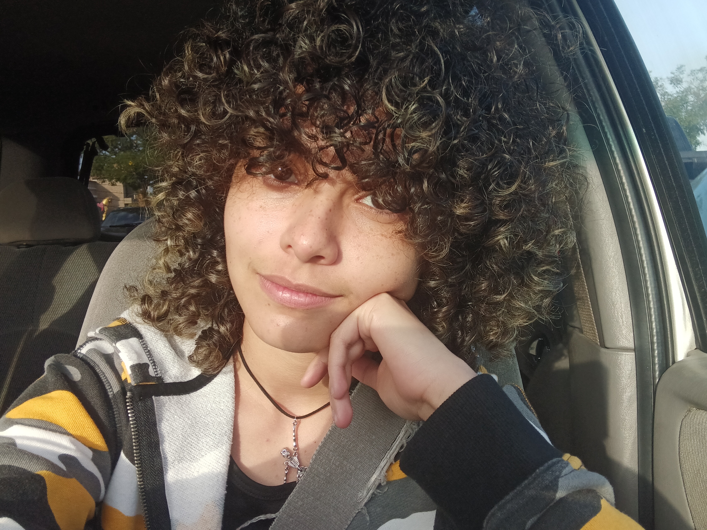
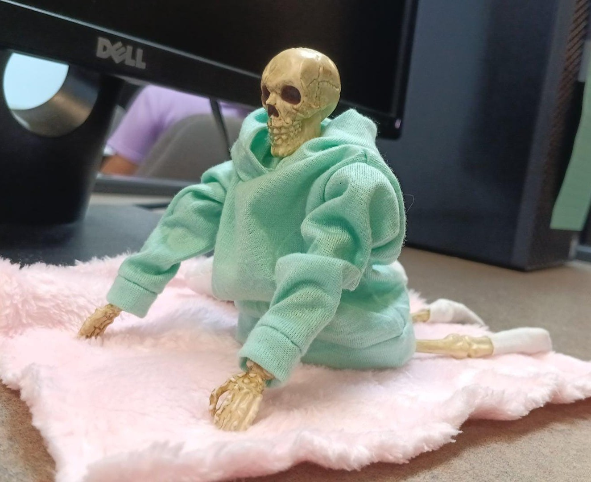
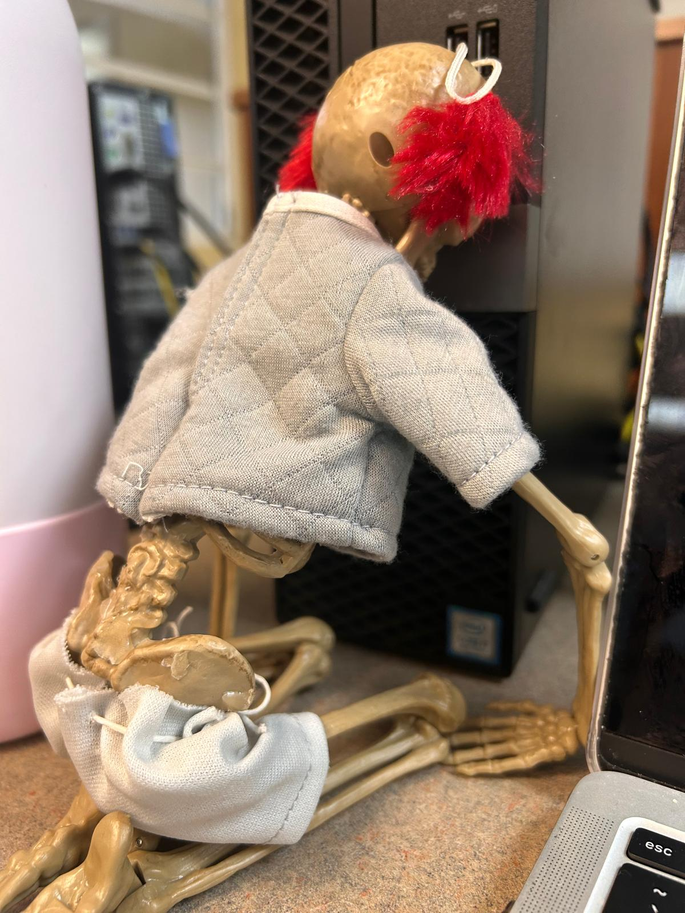
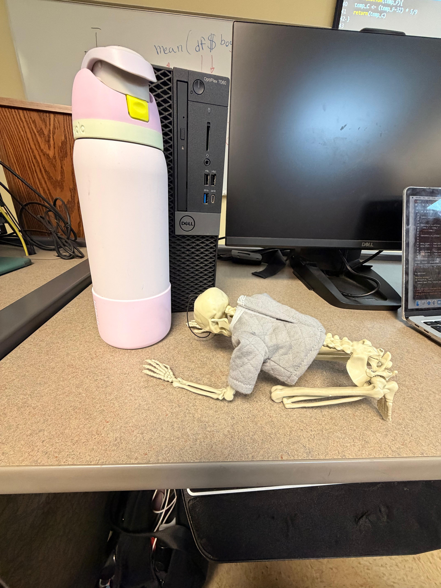
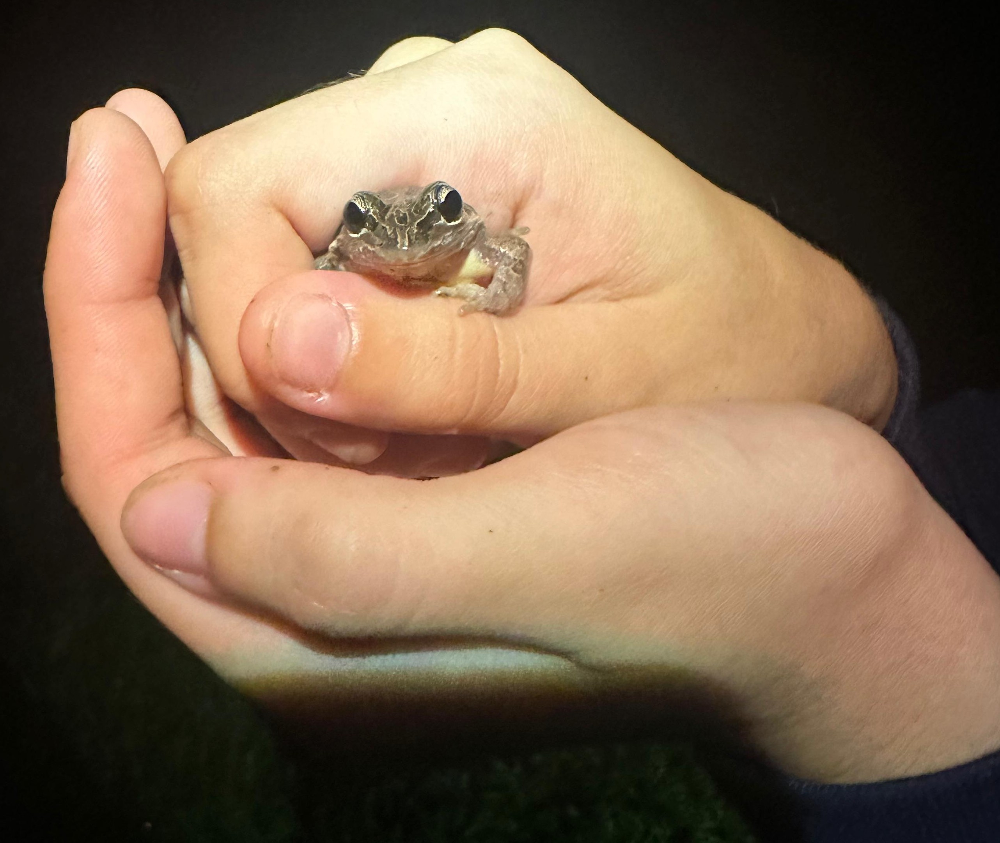
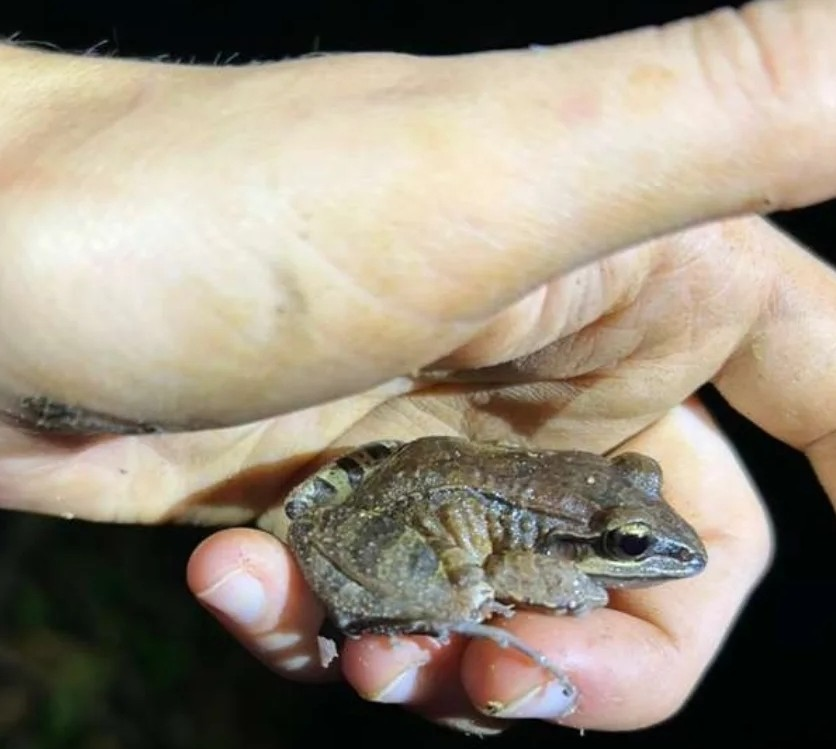
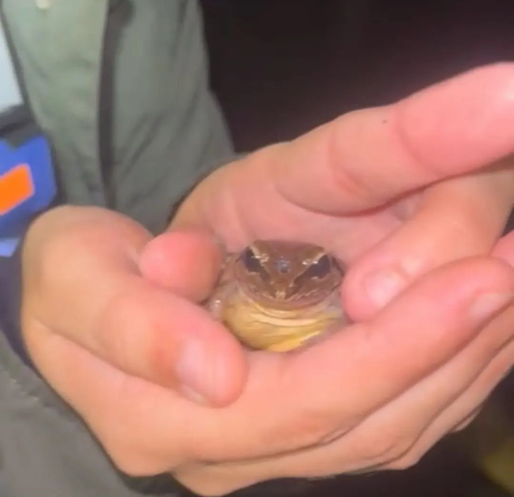

## __About me__

* Tengo __siete__ esqueletos de apoyo emocional: 
  -Sprite 
  

  
  

  -Coke 
  

  
  

  -Pepper 
  -Fanta 
  

  
  

  -Dew 
  -Kist 
  -Ginger 
* Mi segundo nombre es __Nicole__ 
* Me gusta ir al bosque __de noche__ 
* Rapto ranitas de labio blanco (*Leptodactylus albilabris*) __por diversión__ 

# __Mi proyecto__
Como parte de mi tésis, estaré realizando censos poblacionales de *Pholidoscelis wetmorei*, o siguana de cola azul puertoriqueña, dentro del Bosque Estatal de Susúa, ubicado entre los municipios de Yauco y Sabana Grande.

Mi objetivo es identificar qué tipo de vegetación prefiere dentro de un mismo bosque, cómo se está distribuyendo en relación al espacio disponible y la presencia de *Pholidoscelis exsul*, la cual tiene una ventaja en cuanto a tamaño y distribución.

# __Assignments__ 

Homework 1

### [assignment 1](Tareas/Assignment-1.html)

